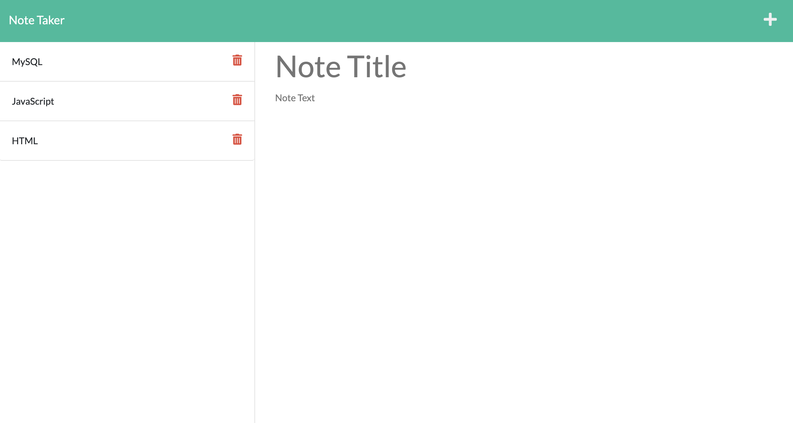

# Note-Taker 

## Table of Contents 
1. [Description](#description)
2. [Visuals](#visuals)
3. [Resources](#resources)

## Author:

Safwan Islam

## Description
In this challenge, there is code which builds out a note taker. When I first open up the page, I am presented with a page which says "note taker" and has a "get started" button. Once that button is clicked the user is sent to another page which is the actual notes page. On the right-hand side, the user can enter notes, click the save button, and the title is saved to the left-hand side. If the user clicks the saved title on the left-hand side, the notes show up on the right-hand side. If the user clicks the delete button, that specific note is deleted. This application is deployed to heroku, and is overall a way to take, save, and delete notes.

## Visuals

## Resources
[Live Site](https://saislam10.github.io/note-taker/)

[GitHub Repository](https://github.com/saislam10/note-taker)